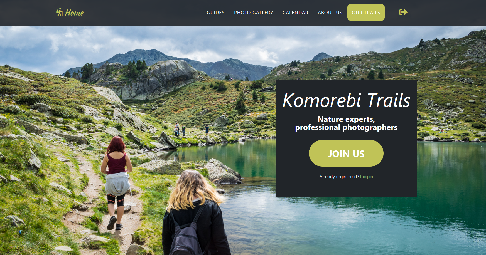
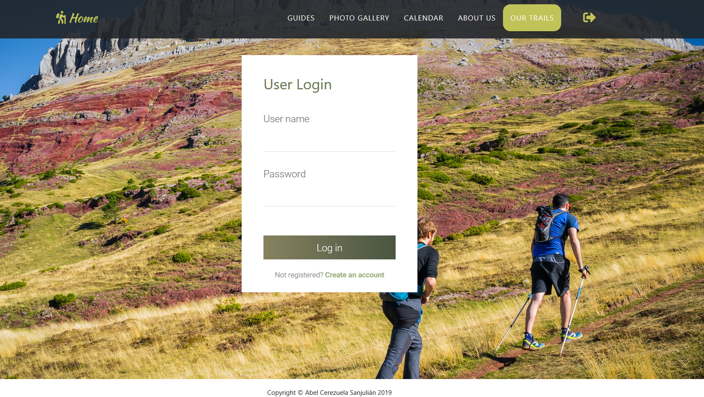

===================================================================================================
Guia de com reservar una ruta de senderisme a la web Komorebi Trails, per Abel Cerezuela Sanjulián
===================================================================================================

.. sectnum::

.. contents:: Table of contents

Introducció
~~~~~~~~~~~~~~
En aquest document, a mode de guia per l'usuari, s'ensenyarà com fer una reserva d'una ruta de senderisme guiada en la web Komorebi Trails.

Passos a seguir
~~~~~~~~~~~~~~~~~~
Registrar-se / Iniciar sessió
----------------------------------
Per poder reservar rutes en la web Komorebi Trails és indispensable estar registrat. En cas de que no ho estiguis, has d'accedir al formulari de registre
a través del botó JOIN US que es mostra en la imatge següent:

Seguidament hauràs d'omplir el formulari de registre on se't demanarà el teu nom complet, un nom d'usuari, una contrasenya i un correu electrònic.
Si ets un treballador/-a de l'empresa Komorebi Trails, també hauràs d'omplir el camp Employee ID amb el codi que t'hauran proporcionat.
Si no ets un treballador/-a de l'empresa, deixa aquest camp en blanc.

Formulari de registre:

Un cop completat el registre tindràs accès complet a la web.

En cas de que ja fossis un usuari registrat, només cal que iniciïs sessió a través de la icona d'entrada situada en la part superior detra de la barra de navegació;
o bé amb l'accés que pots trobar sota del botó de JOIN US.

En la pantalla de inici de sessió escriu el teu nom d'usuari i la teva contrassenya:

****

Elegir una ruta des de la secció Book a Trail
-------------------------------------------------
Un cop hagis iniciat sessió, tindràs accés complet a tota la web i a les funcionalitats de reserva de rutes de muntanya i de compra de fotografies.

Per fer una reserva, et pots dirigir a l'apartat Calendar i elegir entre les rutes que apareixen en el calendari, o bé pots accedir al llistat de totes les rutes des del
botó BOOK A TRAIL i elegir la ruta que desitgis realitzar, fent clic en el botó BOOK IT!.

En aquest cas, aprendrem a fer una reserva seguint aquesta segona opció.

Pàgina de rutes a la qual s'accedeix apretant al botó BOOK A TRAIL :

Abans d'elegir una ruta, fixa't que pots filtar-les segons les teves preferències, gràcies als filtres situats al panell de l'esquerra.

A més, si desitjes tenir més informació sobre qualsevol ruta, només cal que cliquis en el seu nom i se t'obrirà una pàgina detallada com la següent:

Tornant al llistat de rutes, suposem que ja has elegit la que vols realitzar. Així que fes clic al botó BOOK IT! i accediràs al calendari on apareixen els dies que es realitza la ruta.

****

Elegir una data de les ofertades dins de Calendar
------------------------------------------------------
Fes clic sobre el nom de la ruta que apareix en el dia que vulguis realitzar-la:

****

Omplir el formulari de reserva
--------------------------------------
Finalment, un cop escollit el dia, hauràs d'omplir el formulari de reserva. Aquí se t'informarà del preu de la ruta (totes es paguen en mà el mateix dia de la ruta), i se't demanarà el número de persones
que la faran, la teva experiència en senderisme, el teu propòsit i un correu electrònic:

****

Comprovar la safata d'entrada
-----------------------------------
Al fer la reserva t'arribarà un correu electrònic d'aquest estil:

Cancel·lar la reserva o canviar-la per un altre dia
~~~~~~~~~~~~~~~~~~~~~~~~~~~~~~~~~~~~~~~~~~~~~~~~~~~~~~~~~~~~~~~~~~~~~~
Si desitges cancel·lar la teva reserva o bé canviar-la per un altre dia, posa't en contacte amb l'empresa a través del correu komorebi.trails@gmail.com
